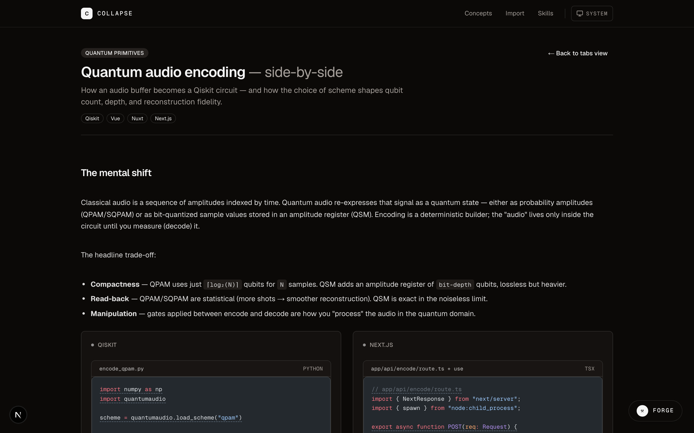

# Collapse

Part of [akaOSS](https://www.akaoss.dev/projects/collapse) — https://www.akaoss.dev/projects/collapse

**A Claude Code skill-building framework.**
Next.js 16 + TypeScript — three pluggable ingestors (MDX lessons, Jupyter `.ipynb` / MyST `.md`, and a one-file extension pattern for any source format) feed a typed pipeline that compiles each pattern into a `SKILL.md` and atomically writes it to `~/.claude/skills/`.

Collapse exists because Claude's default knowledge is stack-agnostic, but most developers live inside one stack at a time. The same idea — reactive state, lifecycle, error boundaries, data fetching — lands differently in React, Vue, and Nuxt, and a "generic" answer costs round-trips. Collapsed skills carry your cross-stack vocabulary so Claude reaches for the right idiom on the first try, with trigger phrases derived from your annotations.

The repo ships with 21 cross-stack reference lessons under [`examples/concepts/`](examples/concepts/), organized as three **example families** so no single domain is the point:

- **Web frameworks** — React/Next.js, Vue, Nuxt (reactive state, side effects, composition, two-way binding, loading/empty/error states…)
- **Tooling patterns** — structured tagging, information density, progressive import fallback, HITL annotation…
- **Side-effectful set** — the honest MCP target: scaffold a route, run a shell task, write a file atomically.

A general **React-hooks** sample notebook under [`examples/notebooks/`](examples/notebooks/) exercises the import flow end-to-end. Collapse compiles any lesson or notebook to a `SKILL.md` — and, **new in v0.2**, to an [MCP server scaffold](docs/roadmap.md) that exposes the pattern as an invocable tool.

---

## Features

### Ingestors

- **MDX lessons** — annotated code fences with `{lines#id}` metadata linked to sibling `<Note>` JSX blocks, scoped per-stack via `<LangTab lang="...">`. Frontmatter-validated. Cached at module load. Sources read from `examples/concepts/*.mdx`.
- **Jupyter notebook + MyST chapter import** — `/import` accepts pasted `.ipynb` JSON, uploaded files, or MyST `.md` strings. Parses `cell_type ∈ { code, markdown }`, coerces `source: string | string[]` correctly, infers kernel language from `metadata.kernelspec`. Extracts MyST admonitions (`:::{note}`, `:::{warning}`, `:::{important}`, `:::{tip}`) from adjacent markdown cells for automatic annotation prefill.
- **Pluggable extension model** — any source format ships in ~4 files following the `lib/notebook/` template: `types.ts`, `parse-*.ts`, optional extractors, `to-annotation-input.ts`. Worked example in [docs/build-your-own-ingestor.md](docs/build-your-own-ingestor.md).

### Template engine

- **Two entry points** — `generateAnnotationSkillDraft(input)` (one annotation → one skill) and `generateSkillDraft(lesson)` (whole lesson → one skill), both in `lib/skill-template.ts`.
- **Description composition** — auto-generates Claude trigger phrases from annotation `tip`, `remember`, and lesson title; packs ≤5 per skill.
- **Cross-language equivalents** — populated automatically from sibling `<LangTab>` blocks; reduces stack-mismatch round-trips.
- **Frontmatter rendering** — `renderSkillFile(draft)` emits YAML-frontmatter markdown via `js-yaml`; `lineWidth: -1` to keep descriptions unwrapped.
- **Skill quality linter** — `lib/skill-quality.ts` returns one of `clean | info | warn` based on description length, trigger-phrase ambiguity, missing kebab-case names, and oversized bodies. Surfaced as colored dots in `/skills`.

### Persistence

- **Local atomic writes** — `POST /api/skills` uses `.tmp + rename` for crash safety. Zod-validated payloads. Path traversal rejected (any `name` escaping `~/.claude/skills/` returns 400). Collision returns 409 with the existing description for diff context; no auto-suffix.
- **Read-back UI** — `/skills` reads `~/.claude/skills/` directly via `node:fs`, sorted by `mtimeMs` descending, with quality verdicts and `(size / 1024).toFixed(1) KB` per skill.
- **No telemetry. No cloud. No database.** The filesystem is the storage layer.

### Lesson UI

- **Shiki syntax highlighting** with a custom annotation transformer that wraps annotated lines in `<span class="annot" data-annot-id>` for hover/click reveal.
- **Color-coded annotation kinds** — `core | note | gotcha | mistake | mnemonic | cross`, each with a calibrated OKLCH background + dashed-to-solid border state for pinned notes.
- **Cross-stack grid view** — `/concepts/{slug}/grid` stacks all `<LangTab>`s side-by-side for direct comparison.
- **Subtle motion on import stages** — `motion/react` (formerly framer-motion), `duration: 0.2`. Sparing by design.

---

## Requirements

- macOS, Linux, or Windows
- Node 20+
- pnpm 10+ — `corepack enable` or `npm i -g pnpm`
- Claude Code installed and configured (skills are loaded from `~/.claude/skills/` on session start)

## Quick start

```bash
git clone https://github.com/akaieuan/collapse.git
cd collapse
pnpm install
pnpm dev
```

Open [http://localhost:3000](http://localhost:3000):

1. Browse the lessons under **Concepts** — pick any family (a web-framework lesson like `side-effects`, a tooling pattern like `tag-kit-structured-tagging`, or the side-effectful `scaffold-a-next-route`).
2. Open a lesson, hover an annotated token to reveal the note.
3. Click **Collapse** in the toolbar — `~/.claude/skills/{name}/SKILL.md` is written, toast confirms the path. Flip the target toggle to **MCP tool** to emit a server scaffold under `~/.claude/mcp-servers/{name}/` instead.
4. Open a new Claude Code session — the skill (or MCP tool) loads automatically; ask about the pattern.

For the notebook on-ramp, hit **/import** and load the sample [`use-debounced-value.ipynb`](examples/notebooks/use-debounced-value.ipynb) React-hooks notebook — or drop in your own.

---

## Architecture

Three-layer pipeline. Each boundary is a TypeScript interface; no layer reaches into another.

```
┌─────────────────┐   ┌────────────────────────┐   ┌───────────────┐
│  ingestor       │──▶│  template engine       │──▶│  persistence  │
│  (the on-ramps) │   │  lib/skill-template    │   │  /api/skills  │
└─────────────────┘   └────────────────────────┘   └───────────────┘
   MDX lessons          generateAnnotation-           ~/.claude/
   .ipynb                 SkillDraft()                  skills/
   MyST .md              generateSkillDraft()           {name}/
   your own ▲            renderSkillFile()              SKILL.md
                                                          │
                                                          ▼
                                                   (roadmap: MCP server
                                                    scaffold output)
```

**Type-safe by construction:** ingestors produce `AnnotationSkillInput`, the template engine consumes it without knowing the source format, and persistence consumes a validated `SkillDraft`. Adding a new ingestor doesn't touch the engine. Adding a second output target (MCP server scaffold) doesn't touch the ingestors.

**Stateless:** no database, no runtime config, no global state. The skills directory IS the state — read directly on every request.

**Atomic:** writes go to `{file}.tmp` then `fs.rename()` into place, so concurrent or interrupted writes never produce a partial `SKILL.md`.

### Source layout

```
app/
├── api/skills/route.ts            POST handler (Zod, atomic write, 409)
├── api/skills/draft/route.ts      Lesson → draft preview endpoint
├── api/mcp-servers/route.ts       POST handler → MCP scaffold (mirrors skills)
├── concepts/[slug]/               MDX lesson viewer (tabs view)
├── concepts/[slug]/grid/          Cross-stack grid view
├── import/                        Notebook import flow
├── skills/                        ~/.claude/skills/ directory viewer
├── layout.tsx                     Root layout (theme, fonts, nav)
└── page.tsx                       Concepts index

lib/
├── lessons/                       MDX ingestor (loader, extract, types)
├── notebook/                      .ipynb + MyST ingestor (parsers, admonition
│                                  extractor, adapter)
├── shiki/                         Syntax highlighting + annotation transformer
├── skill-template.ts              Template engine — draft generation, frontmatter
├── mcp-template.ts                MCP scaffold engine — second output target
├── skill-quality.ts               Skill linter (clean | info | warn)
└── skill-body.ts                  Body composition helpers

examples/
├── concepts/                      21 cross-stack reference MDX lessons (3 families)
└── notebooks/                     Sample .ipynb (React-hooks import demo)

docs/
├── architecture.md                Full version of this section
├── build-your-own-ingestor.md     Worked example for new source formats
├── skill-md-spec.md               SKILL.md format reference
└── roadmap.md                     MCP track + non-goals

scripts/
└── screenshot.mjs                 Playwright-based README screenshot pipeline
```

## Tech stack

| | |
|---|---|
| Language | TypeScript 5 |
| Framework | Next.js 16 (App Router, RSC), Turbopack dev server |
| UI | Tailwind v4 (CSS-first config), shadcn/ui (Nova preset, Base UI under the hood), Geist Sans/Mono |
| MDX | `next-mdx-remote-client`, `remark-mdx`, `@shikijs/rehype` with a custom annotation transformer |
| State | React 19 server components; no client state library |
| Motion | `motion` (formerly framer-motion) — used sparingly for stage transitions |
| Validation | Zod 4 on all API surfaces |
| Test | Vitest (99 tests: parsers, extractors, template engines, API routes) + Playwright e2e |
| Tooling | Playwright (screenshot capture), pnpm 10 workspaces |
| Runtime | Node 20+, local filesystem persistence |

## Why collapse patterns across languages

The leverage isn't "I have skills" — it's "I have skills that move with me when I switch stacks." Five things happen when one pattern lives across multiple `<LangTab>`s:

1. **You learn what's actually different.** Writing the Vue version after the React version forces you to see *where* the languages diverge — `ref` is pull-based, mutates `.value` in place, the wrapper itself is the dependency edge. A distinction you only feel by writing both side-by-side. The lesson captures it.
2. **Claude carries the translation.** Cross-language equivalents in the generated `SKILL.md` are pulled from your other `<LangTab>`s. Asking *"how do I do reactive state in Nuxt"* in a Vue project loads the Vue skill, sees the Nuxt equivalent inline, and answers correctly first try.
3. **The library compounds.** `vue-watch-effect` cites `vue-ref-computed`. Trigger phrases inherit. The skills directory becomes a *vocabulary*, not a pile of files.
4. **Polyglot teams stop being islands.** A `SKILL.md` is a plain markdown file with kebab-case frontmatter. Ship via dotfiles or a private gist; teammates drop them in. A Next dev opening a Vue file gets answers shaped like *their* mental model with the translation key inline.
5. **Switching cost approaches zero.** You're not relearning Vue from scratch — you're learning where Vue and React *diverge*. Cross-stack collapse makes that divergence the explicit unit of learning.

---

## Status

Active development.

- ✅ MDX ingestor with `<LangTab>` / `<Note>` model, 21 reference lessons across three families
- ✅ Notebook ingestor (`.ipynb` + MyST `.md`) with admonition auto-prefill
- ✅ Template engine with cross-language equivalents and trigger-phrase derivation
- ✅ Persistence layer with atomic writes, 409 collision handling
- ✅ Skill quality linter with three-tier verdicts
- ✅ Lesson UI (tabs + grid views), import UI (3-stage flow), skills directory viewer
- ✅ **MCP server scaffold output (v0.2)** — second output target sharing the template-engine layer; the Collapse dialog gains a **skill | MCP tool** toggle, and generated servers handshake over stdio (`npx tsx src/index.ts`). See [docs/roadmap.md](docs/roadmap.md)
- 🚧 Multi-cell notebook composition
- 🚧 MyST chapter URL fetcher

---

## Docs

- [**Architecture**](docs/architecture.md) — the three layers and what's pluggable
- [**Build your own ingestor**](docs/build-your-own-ingestor.md) — worked example for any source format
- [**SKILL.md spec**](docs/skill-md-spec.md) — what Collapse generates, what Claude reads
- [**Roadmap**](docs/roadmap.md) — MCP tool generation track + non-goals

## Screenshots





