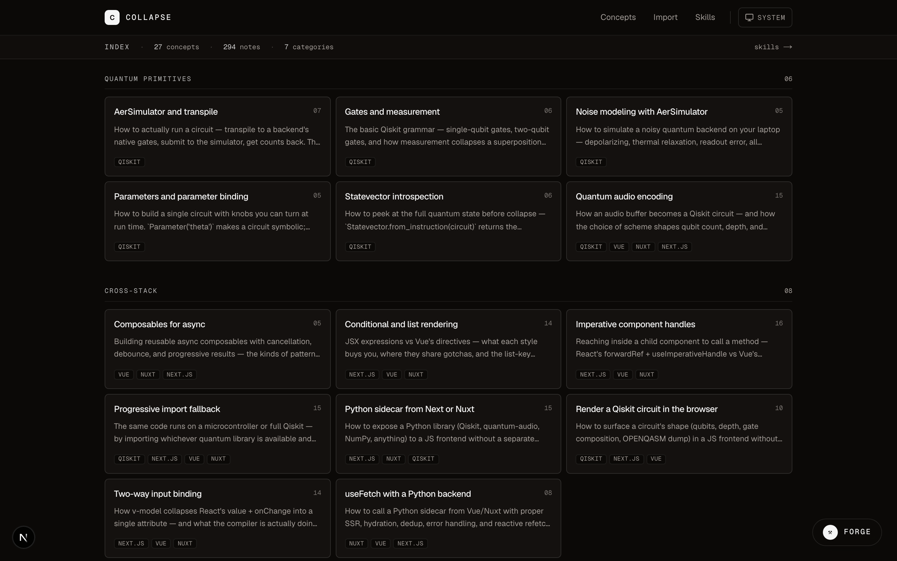
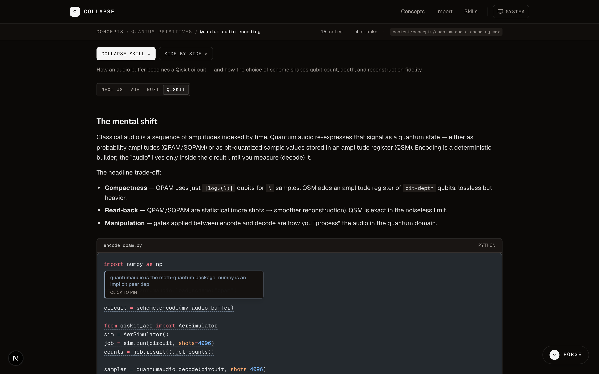
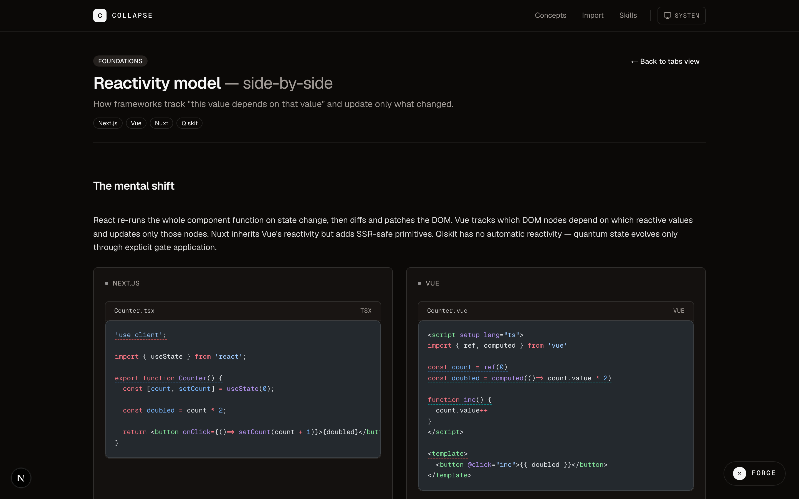
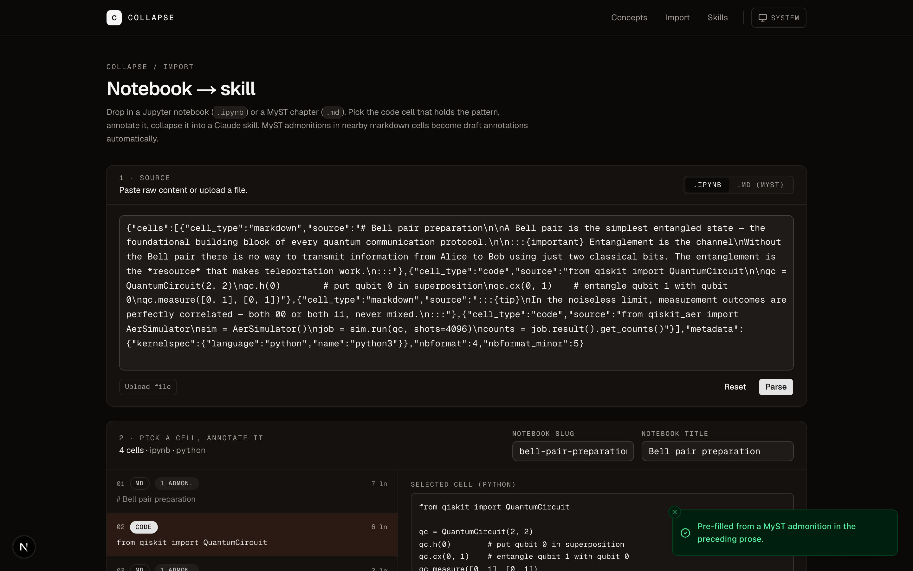
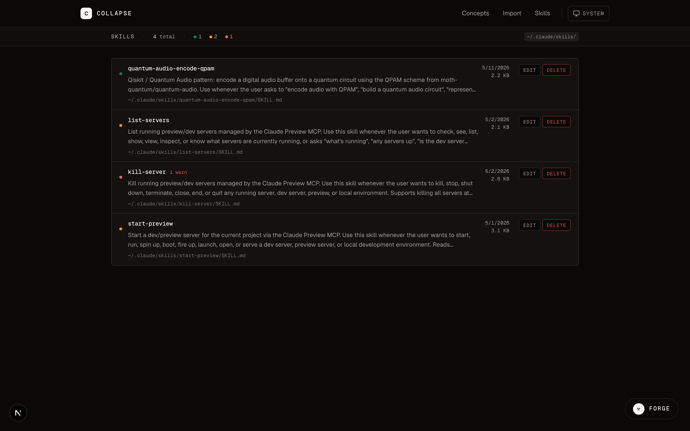

# Collapse

> A framework for collapsing the patterns you understand into Claude artifacts.



## What this is

Collapse turns annotated source material — a lesson you wrote, a notebook you read, anything you can point an ingestor at — into a Claude Code skill that lives in `~/.claude/skills/`. From the moment that file is written, Claude knows the pattern, with your annotations baked into its trigger phrases.

It's three layers: **ingestors** (MDX, notebooks, your own), a **template engine** that produces the artifact, and a **persistence layer** that writes it to the local filesystem. Skills are the first output target. [MCP tool generation is the second](docs/roadmap.md).

Read it as a framework, not an app — the [architecture doc](docs/architecture.md) walks through the layers and what's pluggable. The 17 lessons under [`examples/concepts/`](examples/concepts/) are reference implementations, not the product.

## Why collapse patterns across languages

Most of us live in one stack day-to-day. Mine is Next.js. Yours might be Vue, or Nuxt, or you're deep in Qiskit notebooks. The moment you switch — new job, side project, a teammate's codebase, a research direction — your default tool becomes a fresh learner. You're back to *"what's the Vue equivalent of `useState`?"* hand-waving, and Claude answers with generic syntax that doesn't match your existing instincts.

Cross-language artifacts fix that asymmetry. When you collapse one pattern across multiple stacks, five things happen:

**1. You learn what's actually different.** Writing the Vue version after the Next version forces you to see *where* the languages diverge — not "`useState` ≈ `ref`" but: `ref` is pull-based, mutates `.value` in place, and the wrapper itself is the dependency edge. That's a distinction you only feel by writing both side-by-side. The lesson captures it. The skill carries it forward.

**2. Claude carries the translation.** The generated `SKILL.md` has a `Cross-language equivalents` section pulled from your other `<LangTab>`s. When you ask Claude *"how do I do reactive state in Nuxt"* in a Vue project, it loads the Vue skill, sees the Nuxt equivalent inline, and reaches into both at once. You skip the "Vue version, but Nuxt-flavored" round-trip.

**3. The library compounds.** Every new lesson can cite the ones beneath it. Once you have `vue-ref-computed`, authoring `vue-watch-effect` is faster because the trigger phrases inherit and the recipe builds on a primitive Claude already knows. Your `~/.claude/skills/` directory becomes a *vocabulary*, not a pile of disconnected files.

**4. Polyglot teams stop being islands.** A `SKILL.md` is just a plain markdown file with kebab-case frontmatter. Ship them via a shared dotfiles repo or a private gist; teammates drop them into their own `~/.claude/skills/`. A Next dev opening a Vue file gets answers shaped like *their* mental model — with the translation key inline.

**5. Switching cost approaches zero.** You're not relearning Vue from scratch when you switch — you're learning where Vue and React *diverge*. Cross-stack collapsing makes that divergence the explicit unit of learning, instead of relearning the whole stack each time.

This is the actual leverage. The MDX authoring, the notebook import, the skill quality linter — all of that is plumbing in service of the same outcome: a personal library that closes the cost of moving between languages.

## Quickstart

```bash
git clone https://github.com/akaieuan/collapse.git
cd collapse
pnpm install
pnpm dev
```

Open [http://localhost:3000](http://localhost:3000). Click a lesson under **Concepts**, click **Collapse**, watch the toast: `Collapsed → ~/.claude/skills/{name}/SKILL.md`. Open a new Claude Code session and the pattern is loaded.

## Three on-ramps

### 1 — Author the lesson (MDX)



The default ingestor reads `examples/concepts/*.mdx`. Authoring API:

- **Code fence with annotation metadata** — `{lines#id}` after the language tag.
- **Sibling `<Note>` JSX blocks** — link an `id` to a `tip` + body + `kind` (`core`, `note`, `gotcha`, `mistake`, `mnemonic`, `cross`).
- **`<LangTab lang="...">` wrapper** — scope code + notes to one stack so a single lesson can express the same pattern in Next, Vue, Nuxt, and Qiskit.

The grid view stacks all four stacks for side-by-side comparison — which is where the cross-language vocabulary gets built.



### 2 — Import a notebook (.ipynb / MyST .md)



For patterns that live in someone else's notebook — the [Qiskit textbook](https://github.com/Qiskit/textbook), research notebooks, anything from the [Executable Books](https://executablebooks.org) ecosystem — drop a `.ipynb` or MyST `.md` into `/import`, pick the code cell, annotate, collapse.

MyST admonitions (`:::{note}`, `:::{warning}`, `:::{important}`) in nearby markdown cells **pre-fill the annotation form automatically** — `important` → core, `warning` → gotcha, `tip` → note. The notebook stays ephemeral; only the skill persists.

Try it with [`examples/notebooks/bell-pair-preparation.ipynb`](examples/notebooks/bell-pair-preparation.ipynb).

### 3 — Your own ingestor

`lib/notebook/` is a template, not a special case. The pattern is four files:

```
lib/<your-source>/
  types.ts                    ParsedThing[] shape
  parse-<format>.ts           string → ParsedThing[]
  to-annotation-input.ts      ParsedThing + user input → AnnotationSkillInput
  extract-*.ts (optional)     prose prefilling logic
```

[**docs/build-your-own-ingestor.md**](docs/build-your-own-ingestor.md) walks through it with a worked blog-post example: ~250 LOC for an ingestor + ~150 LOC of vitest. The template engine, persistence, frontmatter handling, collision detection — none of that is your code. You produce an `AnnotationSkillInput`; Collapse handles the rest.

## What gets written

```yaml
---
name: vue-ref-computed
description: "Vue core concept: ref() boxes a primitive so Vue can
  track reassignment. Use whenever the user is writing Vue code that
  touches local reactive state. Trigger phrases: 'ref() boxes a
  primitive…', 'pull-based reactivity', 'vue ref computed'."
---

# Vue: ref() boxes a primitive so Vue can track reassignment

…
```

Full anatomy in [docs/skill-md-spec.md](docs/skill-md-spec.md).

## Skills directory



`/skills` reads `~/.claude/skills/` directly. Quality verdicts (`clean` / `info` / `warn`) come from a local linter so you can see which skills carry their weight at a glance. Edit any in a text editor. Delete with `rm`. Copy somewhere to share.

## Docs

- [**Architecture**](docs/architecture.md) — the three layers and what's pluggable
- [**Build your own ingestor**](docs/build-your-own-ingestor.md) — worked example for any source format
- [**SKILL.md spec**](docs/skill-md-spec.md) — what Collapse generates, what Claude reads
- [**Roadmap**](docs/roadmap.md) — MCP tool generation, multi-cell composition, and what we're explicitly *not* building

## Examples

17 cross-stack lessons under [`examples/concepts/`](examples/concepts/) cover React hooks, Vue composables, Nuxt patterns, Qiskit primitives. One sample notebook under [`examples/notebooks/`](examples/notebooks/) demos the import flow end-to-end.

## Roadmap

Next major target: **MCP tool generation** as a second output type, sitting alongside skills in `~/.claude/`. The architecture supports it — see [docs/roadmap.md](docs/roadmap.md).

## Stack

Next.js 16 (App Router, RSC) · Tailwind v4 · shadcn/ui (Nova preset) · MDX · Shiki · Geist · TypeScript · Vitest · Playwright

---

Built by [Ieuan King](https://ubik.studio).
